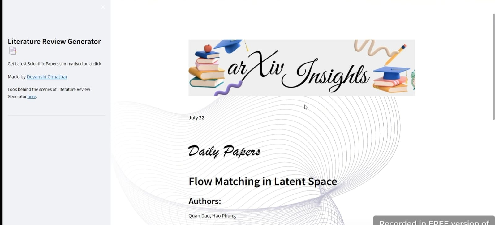

# ARXIV INSIGHTS- AI-Powered Research Paper Summariser

This Project is a Part of IITISoC'23

Welcome Screen of our Webapp

Welcome to **ARXIV INSIGHTS**, your AI companion designed to elevate your research journey. Our web application leverages the BART-Large-CNN model to provide concise and accurate summaries of research papers from arXiv. Whether you're a student delving into academic research or a professional staying abreast of the latest scientific advancements, ARXIV INSIGHTS is here to enhance your research experience.

## Features:

### 1. Daily Paper Summarizer
- **Personalized Recommendations:** Select your areas of interest to receive tailored summaries of the latest papers.
- **Visual Flowcharts:** View a flowchart of the summarized text for a clear and structured understanding.
- **Table Extraction:** Extract and view tables from research papers to easily grasp the data and results.
- **Multilingual Summaries:** Access summaries in multiple languages to cater to a global audience.

### 2. Summarize via URL
- **URL Submission:** Enter the arXiv URL of the paper you want summarized.
- **Instant Summarization:** Receive quick and accurate summaries directly from the URL.
- **Multilingual Output:** Obtain summaries in multiple languages for broader accessibility.

### 3. Export and Share
- **Export Options:** Export summaries in various formats such as PDF or DOCX.
- **Shareability:** Share summaries with colleagues or collaborators effortlessly.

### 4. Real-Time Updates
- **Latest Research:** Stay updated with real-time notifications of new research papers in your field.
- **Trending Papers:** Discover trending papers and emerging topics in your areas of interest.

In all, **ARXIV INSIGHTS** revolutionizes the way you approach research papers. With our AI-powered summarizer, you'll spend less time reading and more time innovating.

Following is the demo video for our project:

## Report

A detailed description of the pipeline, our approaches and pros-cons of the  different techniques used is provided in [this](https://drive.google.com/file/d/1SdfKkiS5EFmHCbCeWCsZuIc4FaBg4M6w/view?usp=sharing) report.

# Contributors
- [Ashmi Chandak](https://github.com/ashmi004)
- [Devanshi Chhatbar](https://github.com/devanshi00)
- [Charmi Edula](https://github.com/charmi2109)

# Mentors
- [Yatharth Gupta](https://github.com/Warlord-K)
